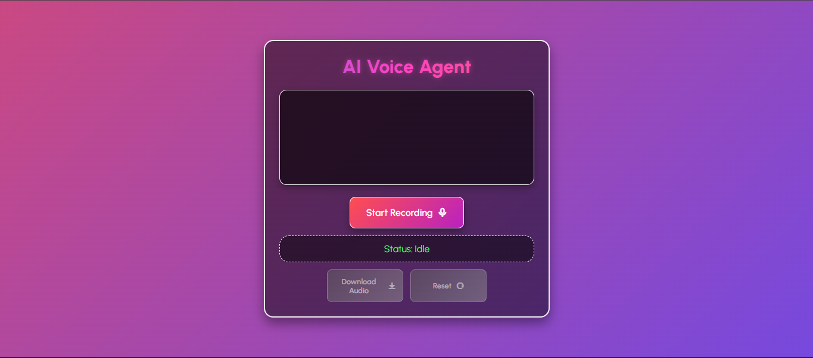

# 🎙️ `AI Voice Agent 🚀`

---

Welcome to `AI Voice Agent` — my project for the `30 Days of AI Voice Agents challenge` with `#BuildwithMurf 🎙️`.
It’s an interactive voice-powered assistant that lets you `speak`, `listen`, and `engage` with AI in real time.

💡 `Powered by`:

- 🧠 **`xAI’s Grok API`** for witty, context-aware answers
- 📝 **`AssemblyAI`** for lightning-fast transcription
- 🔊 **`Murf AI`** for crystal-clear text-to-speech

And wrapped in a **`vibrant UI`** where:

- **`User queries`** dance on the **right** in `blue-purple gradients` ✨
- **`AI replies`** appear on the **left** in `red-purple gradients` 🔥
- **`Errors`** pop in `bold red` for quick visibility 🚨

---

## ✨ `Features`

| 🌟 Feature                | Description                                                                         |
| ------------------------- | ----------------------------------------------------------------------------------- |
| 🎤 **Voice Recording**    | Record audio directly from your browser — no extra tools needed.                    |
| 📝 **Speech-to-Text**     | Lightning-fast, accurate transcription powered by **AssemblyAI**.                   |
| 🤖 **Smart AI Responses** | Context-aware, witty answers via **xAI’s Grok API**.                                |
| 🔊 **Text-to-Speech**     | Crystal-clear, human-like audio from **Murf AI**.                                   |
| 💬 **Chat View**          | Real-time transcripts — **your messages** on the right, **AI replies** on the left. |
| 🧠 **Session Memory**     | Remembers previous conversation turns for better context.                           |
| 🔄 **Auto-Recording**     | Automatically starts listening after each AI reply.                                 |
| 📥 **Download Audio**     | Save your recordings as `.webm` files in one click.                                 |
| 🗑 **Reset Session**       | Instantly clear your chat history and reset the interface.                          |
| 🎨 **Animations**         | Smooth sliding messages, ripples, and pulsing indicators.                           |
| 🚨 **Error Handling**     | Shows clear error messages with fallback audio when APIs fail.                      |

---

## 🛠 `Tech Stack`

| Layer               | Technology                                |
| ------------------- | ----------------------------------------- |
| **Frontend**        | HTML, CSS, JavaScript                     |
| **Backend**         | FastAPI (Python)                          |
| **Speech-to-Text**  | [AssemblyAI](https://www.assemblyai.com/) |
| **AI Reasoning**    | [Google Gemini](https://ai.google.dev/)   |
| **Text-to-Speech**  | [Murf AI](https://murf.ai/)               |
| **Templating**      | Jinja2                                    |
| **Env. Management** | python-dotenv                             |

---

## 🏗 `Architecture`

**`Frontend`** (`templates/index.html`, `static/style.css`)

- Captures audio 🎙️ via MediaRecorder API
- Sends to `/agent/chat/{session_id}` 📡
- Displays **user messages** (right) & **AI replies** (left) 💬
- Plays back generated AI audio 🎶

**`Backend`** (`main.py`)

- Receives audio → Saves to `uploads/` 📂
- Transcribes via AssemblyAI 📝
- Gets AI response from Grok 🤖
- Converts response to audio via Murf 🔊
- Maintains **in-memory chat history** per session 🧠

**`Flow Diagram`**

```plaintext
🎤 User Voice
   ↓
📡 Frontend → FastAPI
   ↓
📝 AssemblyAI (STT)
   ↓
🤖 Grok API (AI Reply)
   ↓
🔊 Murf AI (TTS)
   ↓
🗣 AI Speaks Back
```

---

## 📂 `Project Structure`

```
📦 AiAgentChallenge/DAY13
 ┣ 📜 main.py           # 🚀 FastAPI backend logic
 ┣ 📂 templates         # 🖼️ Frontend HTML (Jinja2)
 ┃ ┗ 📜 index.html
 ┣ 📂 static            # 🎨 CSS, JS, favicon
 ┃ ┣ 📜 style.css
 ┃ ┗ 📜 favicon.ico
 ┣ 📂 uploads           # 🎙️ Saved audio files
 ┣ 📜 .env              # 🔐 API keys (ignored by Git)
 ┗ 📜 README.md         # 📖 Documentation
```

---

## ⚙️ `Setup Instructions`

1️⃣ **`Clone Repository`**

```bash
git clone <your-repo-url>
cd AiAgentChallenge/DAY13
```

2️⃣ **`Create Virtual Environment`**

```bash
python -m venv venv
source venv/bin/activate   # Mac/Linux
venv\Scripts\activate      # Windows
```

3️⃣ **`Install Dependencies`**

```bash
pip install fastapi uvicorn aiohttp assemblyai python-dotenv
```

4️⃣ **`Set Environment Variables`** in `.env`

```env
MURF_API_KEY=your_murf_api_key
ASSEMBLYAI_API_KEY=your_assemblyai_api_key
GROK_API_KEY=your_grok_api_key
```

5️⃣ **`Run the Server`**

```bash
uvicorn main:app --reload
```

6️⃣ **`Open in Browser`**

```
http://127.0.0.1:8000
```

---

## 🖼️ `Screenshot`



Coming soon:

- Conversation UI
- User messages (right, blue-purple)
- AI responses (left, red-purple)
- Smooth animations in action

---

## 🌟 `Future Enhancements`

- 🎙️ Voice selection for Murf AI responses
- 🧩 Intent recognition for smarter interactions
- ⏱ Message timestamps
- 🔘 Interactive control buttons

---

## 💪 `Challenges Overcome`

- Switched from Gemini to Grok API to dodge **429 quota errors**
- Designed **ChatGPT-like UI** with clean message alignment and gradients
- Implemented **fallback audio** for API error resilience

---

## 🙌 `About Me`

I’m a developer fueled by curiosity & creativity — blending **code**, **design**, and **AI** into magical projects.
This challenge is my journey to push the limits of AI voice tech.
**Join me** as I build the future, one voice at a time! 🚀

Crafted with ❤️ for **`#30DaysOfVoiceAgents`** with **`Murf AI`**


